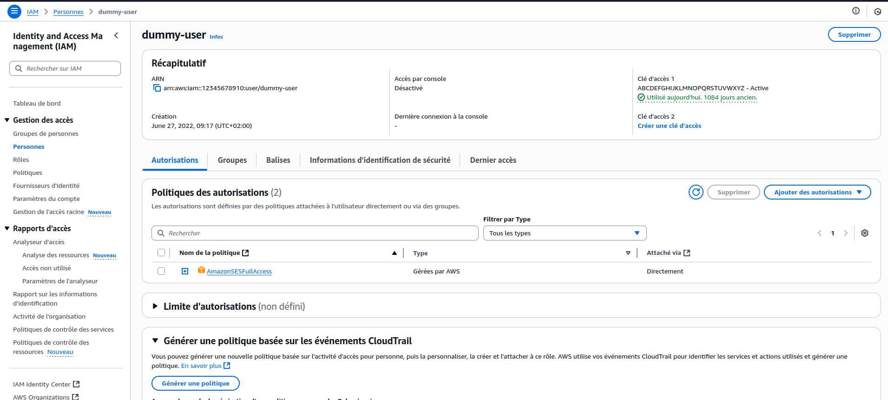
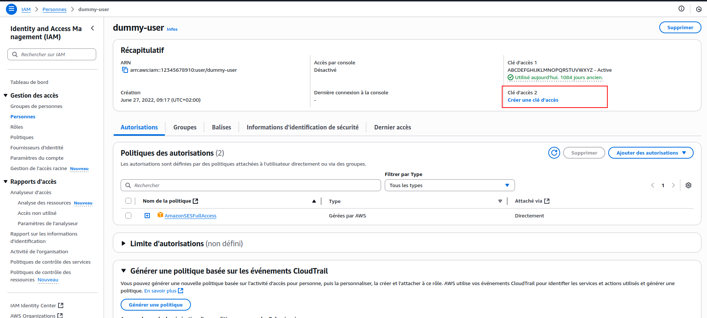
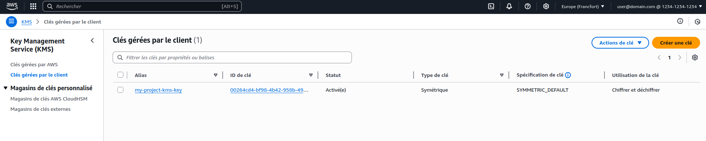

# Recovery procedure
## What to do when you have fully lost your environment and want to recover it with Occulta.
To restore your environment using Occulta, you will need to have an access to your KMS key.
A good practice is to store your AWS access key and secret in your `.env`, the one you just lost...

## Get AWS credentials
Access AWS dashboard and go to your project user's settings :


If you don't have a copy elsewhere of your "Access Key 1" secret, you will have to create a new one.

(Follow [AWS procedure](https://docs.aws.amazon.com/IAM/latest/UserGuide/id_credentials_access-keys.html) to create a new access key)

Keep the access key and secret that you just created in a safe place, you will need them to restore your environment.

## Get Your KMS key ID and region

You can access your KMS key in the AWS dashboard, under "Key Management Service" > "Customer managed keys".
You will also need the region (in the top right corner of the dashboard) if you had set it in your environment file.

## Restore your environment
You can now restore your environment by running the following command:
```bash
php artisan occulta:decrypt path/to/your/encrypted/archive.zip
```

Occulta will prompt you for your KMS Key ID, AWS access key and secret, and eventually region, then it will decrypt the archive and restore your environment as a `.env.decrypted` file.
